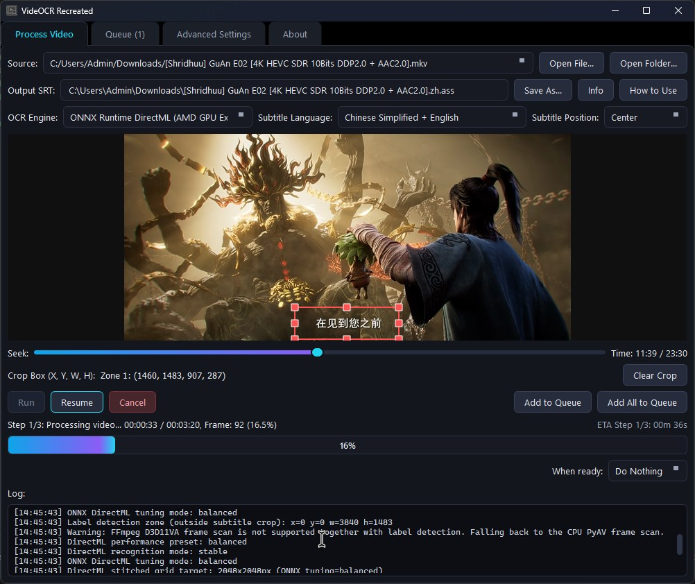
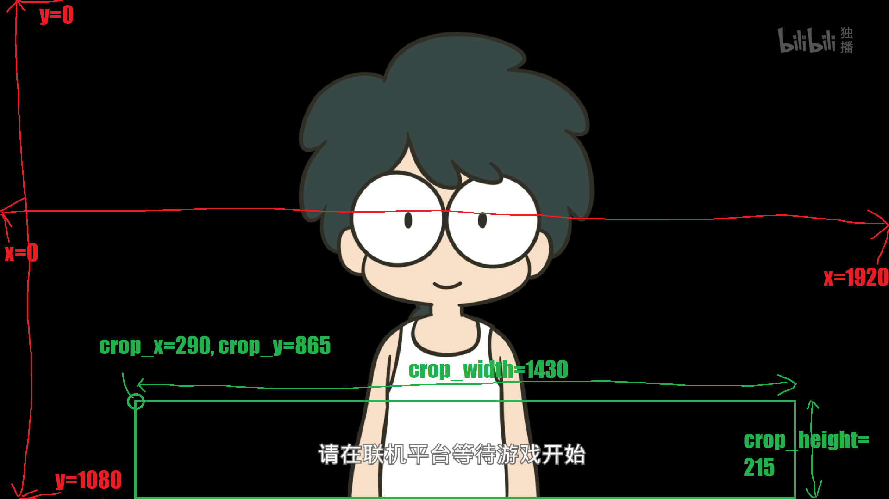

<p align="center">

  <h1 align="center">VideOCR Recreated</h1>
  <p align="center">
    Extract hardcoded subtitles from videos with a modern PySide6 GUI, 200+ languages, and experimental AMD DirectML GPU support.
    <br />
    <em>Forked from <a href="https://github.com/timminator/VideOCR">VideOCR</a> (by <code>timminator</code>), via <a href="https://github.com/BaseCrunch/VideOCR-AMD-DirectML">VideOCR-AMD-DirectML</a> (by <code>BaseCrunch</code>) — with more features on top.</em>
    <br />
  </p>
</p>

<br>

## About

VideOCR Recreated extracts hardcoded / burned-in subtitles from videos and exports them as `.srt` (or `.ass` with label detection) subtitle files.

<p align="center">
  
  <br />
  <em>VideOCR Recreated main window</em>
</p>

This project is a **fork of a fork**. It builds on:

1. The original **[VideOCR](https://github.com/timminator/VideOCR)** by `timminator` — the base subtitle-extraction project.
2. **[VideOCR-AMD-DirectML](https://github.com/BaseCrunch/VideOCR-AMD-DirectML)** by `BaseCrunch` — a fork that added the experimental **AMD GPU acceleration path for Windows** using **DirectML** / **torch-directml** / **EasyOCR** with a hybrid OCR mode, DirectML GPU selection, performance presets, and the FFmpeg D3D11VA frame-scan path.

VideOCR Recreated keeps all of the above and adds **more features on top**:

- A complete **PySide6 (Qt)** GUI rewrite — a modern, easy-to-use interface that replaces the old PySimpleGUI application.
- **Label detection** (text outside the subtitle crop, saved as `.ass`)
- A reworked **warm-obsidian & gold** visual theme.
- Further refinements (see [What changed](#what-changed-in-this-fork) below).

Supported OCR engines:

- Local OCR with **[PaddleOCR](https://github.com/PaddlePaddle/PaddleOCR)**
- Hybrid cloud recognition with **Google Lens**
- **ONNX Runtime DirectML (AMD GPU Experimental)** — experimental; uses the unified RapidOCR package with PP-OCRv6 models; falls back to the EasyOCR DirectML Hybrid backend when the ONNX/DirectML stack is unavailable

### What changed in this fork

Relative to the `BaseCrunch/VideOCR-AMD-DirectML` fork this project is based on:

- GUI rewritten from scratch in **PySide6** (modern warm-obsidian + gold dark theme, resizable layout, native HiDPI support).
- **Label detection** — detects text *outside* the subtitle crop (e.g. people's / places' names) and saves the result as a positioned `.ass` subtitle file.
- **Update checking was removed** — the GUI no longer polls GitHub for new versions.
- **Benchmarking and the "Apply Tested AMD Preset" button were removed** from the GUI (the CLI benchmark flags and `tools/benchmark_*.py` helpers remain available for advanced users).
- The **DirectML GPU selection is now saved to the config file** and restored across sessions; it **defaults to GPU 0** (the first DirectML adapter).
- The DirectML and label-detection settings are **disabled in the GUI** until their master toggle (Enable GPU Usage / Enable Label Detection) is switched on.
- The FFmpeg D3D11VA path uses `-fps_mode vfr` instead of the removed `-vsync 0` option so it works with newer FFmpeg versions.

## AMD DirectML Backend Status

Tested on:

- **Windows 11**
- **AMD Radeon RX 7900 XTX** and **AMD Radeon RX 6700 XT**
- **Python 3.12**
- **torch-directml**
- **EasyOCR 1.7.2**

Current AMD backend:

| Stage | Device |
| --- | --- |
| Video decoding / frame filtering | CPU |
| Image preprocessing / stitching | CPU |
| EasyOCR text detection | AMD GPU through DirectML |
| EasyOCR text recognition | CPU fallback |
| Subtitle merging / SRT generation | CPU |

The recognition stage currently stays on CPU because EasyOCR's LSTM/CRNN recognizer can hit DirectML operator compatibility issues, such as:

```text
aten::_thnn_fused_lstm_cell
```

The hybrid mode is intentional. It avoids the crash while still using the AMD GPU for the text-detection part of the OCR pipeline.

## Important Notes

- The AMD DirectML path is **experimental**.
- DirectML mode is currently intended for **Windows AMD GPUs**.
- NVIDIA users should still use the normal CUDA builds.
- CPU mode still works.
- Google Lens mode still works where available.
- EasyOCR may download model files the first time it runs.
- Python **3.12** is recommended.
- Python **3.13** is not recommended because `torch-directml` may not provide compatible wheels for it.

## Setup

### Windows CPU / CUDA / Normal Use

You can either install VideOCR Recreated with the setup installer or download a folder containing the executable and required files, then unzip it to your desired location.

### Windows AMD DirectML Development Setup

Use this setup if you want to run the AMD DirectML fork directly from source.

Open CMD in the repository folder and run:

```bat
py -3.12 -m venv .venv --upgrade-deps
call .venv\Scripts\activate.bat

python -m pip install --upgrade pip setuptools wheel
python -m pip install -e ".[directml]"
python -m pip install --force-reinstall --no-cache-dir "sympy==1.13.3" "mpmath==1.3.0"
```

If your PC has both integrated AMD graphics and a discrete AMD GPU, force the DirectML adapter.

On many systems the discrete GPU is adapter index `1` (the iGPU is `0`); check with `python tools\list_directml_adapters.py` and set:

```bat
set VIDEOCR_DIRECTML_DEVICE_INDEX=1
```

Then test DirectML:

```bat
python tools\test_directml.py
python tools\diagnose_easyocr_directml.py
```

Expected result:

```text
DirectML tensor test: 3.0
DirectML device: privateuseone:1
Reader OK
All DirectML diagnostics passed.
```

Then start the GUI:

```bat
python VideOCR_qt.py
```

> **DirectML GPU persistence:** in the GUI, the DirectML GPU dropdown (Advanced Settings) is saved to `videocr_gui_config.ini` and restored on the next launch. The default is **GPU 0**. If your discrete Radeon card is adapter `1`, select `GPU 1` once — the GUI will remember it.

### NVIDIA CUDA Development Setup

Use this setup to run VideOCR Recreated from source with NVIDIA GPU (CUDA) acceleration. Local CUDA OCR uses the **PaddleOCR** engine with GPU usage enabled. The `easyocr_directml` / `onnx_directml` engines are AMD/Windows-only and are not needed here.

#### Requirements

- An NVIDIA GPU with a compatible driver. Verify with `nvidia-smi`.
- Python 3.12 recommended.
- The matching CUDA build of the PaddleOCR helper (see compatibility below).

The CLI runs an automatic NVIDIA hardware check against this table:

| Build | GPU Compute Capability | Minimum NVIDIA Driver |
| --- | --- | --- |
| CUDA 11.8 | 6.1 – 8.9 (Windows) / 6.0 – 8.9 (Linux) | 451.22 (Windows) / 450.36.06 (Linux) |
| CUDA 12.9 | 7.5 – 12.0 | 527.41 (Windows) / 525.60.13 (Linux) |

#### Windows

Open CMD in the repository folder and run:

```bat
py -3.12 -m venv .venv --upgrade-deps
call .venv\Scripts\activate.bat
python -m pip install --upgrade pip setuptools wheel
python -m pip install -e .
```

Verify the GPU is visible:

```bat
nvidia-smi
```

#### Linux

```bash
python3.12 -m venv .venv
source .venv/bin/activate
python -m pip install --upgrade pip setuptools wheel
python -m pip install -e .
```

A working `dbus` installation is recommended for notifications:

```bash
sudo apt-get install dbus
nvidia-smi
```

#### Getting the CUDA PaddleOCR helper

From source the PaddleOCR / Chrome Lens helper executables are not bundled. Either download a prebuilt GPU release and copy the `PaddleOCR...` / `Chrome-Lens-OCR...` folders next to the CLI, or build a CUDA target (this downloads and packages the correct helper automatically):

```bash
python build.py --target gpu-cuda11.8
# or
python build.py --target gpu-cuda12.9
```

#### Running with CUDA

Enable GPU usage so the CLI performs the NVIDIA hardware check and uses the CUDA device:

```bat
python CLI\videocr_cli.py --video_path "C:\Path\To\video.mp4" --output "C:\Path\To\output.en.srt" --ocr_engine paddleocr --lang en --use_gpu true
```

Then start the GUI:

```bat
python VideOCR_qt.py
```

In the GUI select **OCR Engine: PaddleOCR (Det. + Rec.)** and check **Enable GPU Usage**.

> NVIDIA users should use the CUDA builds, not the AMD DirectML builds. The DirectML path is intended for AMD GPUs on Windows.

### Windows Graphics Preference

If Windows still sends DirectML workloads to the integrated GPU, force Python to use the high-performance GPU:

```text
Windows Settings
→ System
→ Display
→ Graphics
→ Add desktop app
→ Select:
  .venv\Scripts\python.exe
→ Options
→ High performance
→ (pick your discrete AMD GPU, e.g. "AMD Radeon RX ...")
```

### Linux

Download the tarball archive from the releases page and unzip it to your desired location.

Optionally, you can add VideOCR Recreated to your app menus. Open a terminal where you unpacked the archive and run:

```bash
./install_videocr.sh
```

This creates a shortcut for VideOCR Recreated.

You can remove it with:

```bash
./uninstall_videocr.sh
```

## GUI Usage

Import a video and seek through the video using the timeline. You can also use the left and right arrow keys.

Draw a crop box over the subtitle area using click and drag. After selecting the subtitle area, start subtitle extraction with the **Run** button.

For AMD DirectML mode, recommended GUI settings are:

```text
OCR Engine: EasyOCR DirectML / AMD GPU
GPU Usage: checked
Full Frame: unchecked
Crop Area: subtitle area only
Language: English, or your subtitle language
```

Recommended 1080p anime episode settings:

```text
Frames to Skip: 2
OCR Image Max Width: 720
SSIM Threshold: 92
Confidence Threshold: 65–75
Max Merge Gap: 0.1–0.3
```

If subtitles are missed, increase accuracy:

```text
Frames to Skip: 1
OCR Image Max Width: 960
```

If processing is too slow, increase speed:

```text
Frames to Skip: 3
OCR Image Max Width: 720
```

## CLI Usage

There is also a CLI version available. Open a terminal in the VideOCR Recreated folder and run:

### Windows

```bat
.\videocr-cli.exe -h
```

When running from source:

```bat
python CLI\videocr_cli.py -h
```

### Linux

```bash
./videocr-cli.bin -h
```

### Example Usage: Windows Executable

```bat
.\videocr-cli.exe --video_path "Path\to\your\video\example.mp4" --output "Path\to\your\desired\subtitle\location\example.srt" --lang en --time_start "18:40" --use_gpu true
```

### Example Usage: AMD DirectML Source Mode

```bat
set VIDEOCR_DIRECTML_DEVICE_INDEX=1

python CLI\videocr_cli.py ^
  --video_path "C:\Path\To\video.mp4" ^
  --output "C:\Path\To\output.en.srt" ^
  --ocr_engine easyocr_directml ^
  --lang en ^
  --use_gpu true ^
  --use_fullframe false ^
  --crop_x 36 ^
  --crop_y 793 ^
  --crop_width 1862 ^
  --crop_height 273 ^
  --frames_to_skip 2 ^
  --ssim_threshold 92 ^
  --ocr_image_max_width 720
```

## Performance

Local OCR processing can be slow on CPU. Using a GPU is recommended when available.

The fork provides several practical performance paths:

| Mode | Best For | Notes |
| --- | --- | --- |
| `paddleocr` CPU | Compatibility | Fully local but can be slow |
| `paddleocr` CUDA | NVIDIA GPUs | Fastest official local GPU path |
| `google_lens` | Accuracy / cloud recognition | Requires internet |
| `easyocr_directml` | AMD Windows GPUs | Experimental hybrid DirectML mode |

### AMD DirectML Frame Scan Modes

This fork includes experimental Step 1 frame-scan modes intended for AMD GPUs on Windows:

```text
CPU SSIM (compatible)
AMD DirectML SSIM (experimental)
AMD FFmpeg D3D11VA Decode + DirectML SSIM (prototype)
```

The FFmpeg D3D11VA prototype asks FFmpeg to use D3D11VA hardware decode, then feeds the cropped subtitle area into the EasyOCR DirectML pipeline. It is best tested with a single subtitle crop area and FFmpeg available on PATH. For reliable use, keep DirectML Recognition Mode on `Stable Hybrid`; use `AMD Max Auto` only for experiments.

A quick diagnostic is available:

```bash
python tools/benchmark_amd_decode.py "C:\path\to\video.mp4" --crop 1920:287:0:793 --scale 720:-2 --frames-to-skip 1 --seconds 60
```

### AMD DirectML Performance Notes

GPU usage may appear lower than gaming or rendering workloads. This is normal.

The AMD DirectML backend processes OCR in bursts:

1. CPU reads and filters frames.
2. CPU creates stitched OCR image grids.
3. The AMD GPU performs text detection through DirectML.
4. CPU performs text recognition for compatibility.
5. CPU merges subtitle lines and writes the `.srt`.

Because only part of the OCR pipeline runs on the GPU, GPU usage around `10–40%` can be normal. This does not mean the GPU is unused.

For discrete AMD GPUs, the GUI exposes DirectML grid tuning and a DirectML GPU dropdown. Larger stitched grids reduce per-image overhead and can keep the GPU busier during the detection pass. Good starting values are:

```text
DirectML GPU: your discrete AMD GPU (e.g. GPU 1: AMD Radeon RX ...)
DirectML Grid Max Width: 2400
DirectML Grid Max Height: 2400
Frames to Skip: 2 for speed, 1 for accuracy
OCR Image Max Width: 720 for speed, 960 for accuracy
```

The DirectML performance preset controls the grid target automatically:

| Preset | Grid target | Intended use |
| --- | ---: | --- |
| `compatibility` | 1600x1600 | Older/lower-VRAM GPUs, stability first |
| `balanced` | 2400x2400 | Recommended default |
| `max` | 4096x4096 | Larger batches to feed high-end AMD GPUs harder |
| `manual` | Uses the grid width/height fields | Manual tuning |

DirectML Recognition Mode behavior:

| Mode | Detection | Recognition | Notes |
| --- | --- | --- | --- |
| `stable` | DirectML GPU | CPU | Safest; avoids EasyOCR LSTM DirectML crash |
| `auto` | DirectML GPU | Try DirectML GPU, then CPU fallback | Best "max AMD" test mode |
| `experimental` | DirectML GPU | Try DirectML GPU | Still falls back for known LSTM compatibility failures |

## Tips

When cropping, leave a bit of buffer space above and below the subtitle text to improve detection, but do not make the crop box too large.

A tight crop box around the subtitle area is usually much faster and more accurate than full-frame OCR.

### Quick Configuration Cheatsheet

| Option | More Speed | More Accuracy | Notes |
| --- | --- | --- | --- |
| Input video quality | Use lower quality | Use higher quality | Cropping reduces the performance cost of high resolution |
| `frames_to_skip` | Higher number | Lower number | For perfectly accurate timestamps, set this to `0` |
| `ssim_threshold` | Lower threshold | Higher threshold | Lower values reduce the number of images sent to OCR |
| `ocr_image_max_width` | Lower value | Higher value | Lower values are faster; higher values help small text |
| `directml_grid_max_width` / `directml_grid_max_height` | Larger values can reduce overhead | Smaller values use less memory | AMD DirectML mode only |
| Crop area | Tighter crop | Slight buffer around text | Avoid full-frame OCR unless needed |

## Command Line Parameters

### `video_path`

Path to the video where subtitles should be extracted from.

### `output`

Path where the `.srt` subtitle file should be stored.

### `ocr_engine`

Select the OCR engine to use for text detection and recognition.

Valid values include:

```text
paddleocr
google_lens
easyocr_directml
onnx_directml
```

`paddleocr` uses local processing for both text detection and recognition.

`google_lens` uses hybrid processing where local detection is combined with Google Lens recognition. This mode requires an active internet connection.

`easyocr_directml` uses the AMD DirectML fork backend. In the current stable hybrid mode, EasyOCR text detection runs on DirectML / AMD GPU and recognition falls back to CPU.

`onnx_directml` is an experimental ONNX Runtime DirectML backend that uses the unified RapidOCR package with PP-OCRv6 medium models for higher accuracy. The selected subtitle language is forwarded to RapidOCR. If the ONNX stack is unavailable it falls back to the EasyOCR DirectML Hybrid path for that run.

### `lang`

Language of the subtitles.

Supported languages depend on the selected OCR engine.

- For `paddleocr`: see the PaddleOCR documentation.
- For `google_lens`: see the Google Lens / Vision language documentation.
- For `easyocr_directml`: use EasyOCR-supported language codes, such as `en`.
- For `onnx_directml`: the language is forwarded to RapidOCR's unified PP-OCRv6 model, which covers 50 languages including Chinese, English, Japanese, and Latin-script languages.

### `subtitle_position`

Specifies the alignment of subtitles in the video and allows for better text recognition.

### `conf_threshold`

Confidence threshold for word predictions. Words with lower confidence than this value are discarded.

Default value:

```text
75
```

Make it lower if you get too few words in each line.

Make it higher if there are too many extra words in each line.

### `sim_threshold`

Similarity threshold for subtitle lines. Subtitle lines with larger Levenshtein ratios than this threshold are merged together.

Default value:

```text
80
```

Make it lower if there are too many duplicated subtitle lines.

Make it higher if too few subtitle lines are being generated.

### `ssim_threshold`

If the SSIM between consecutive frames exceeds this threshold, the frame is considered similar and discarded during initial frame filtering in Step 1.

A lower value can greatly reduce the number of images OCR needs to process.

On tight subtitle crop boxes, good results may be possible around:

```text
85–92
```

### `post_processing`

Adds a post-processing step for detected text. This can analyze detected text for missing spaces and insert them automatically.

Currently available for:

```text
English
Spanish
Portuguese
German
Italian
French
```

### `max_merge_gap`

Maximum allowed time gap in seconds between two subtitles to be considered for merging if they are similar.

Default value:

```text
0.1
```

Increase this if the output SRT contains repeated subtitle lines that should have been merged.

### `time_start` and `time_end`

Extract subtitles from only part of the video.

Subtitle timestamps are still calculated according to the full video timeline.

### `use_fullframe`

By default, the specified crop area is used for OCR. If no crop is specified, the bottom third of the frame is used.

Set this to `True` to OCR the entire frame.

### `crop_x`, `crop_y`, `crop_width`, `crop_height`

Specify the bounding area in pixels used for OCR.



### `crop_x2`, `crop_y2`, `crop_width2`, `crop_height2`

Specify a second bounding area in pixels for OCR when needed.

### `subtitle_alignment` and `subtitle_alignment2`

Subtitle alignment values for ASS / Advanced SubStation Alpha positioning.

Valid values:

```text
bottom-left
bottom-center
bottom-right
middle-left
middle-center
middle-right
top-left
top-center
top-right
```

### `ocr_image_max_width`

Downscales the cropped image frame so its width does not exceed this value before passing it to OCR.

Lower values improve speed.

Higher values may improve accuracy.

### `use_gpu`

Set to `True` to perform OCR with GPU acceleration where supported.

For AMD DirectML mode, the GUI saves your DirectML GPU selection in the config file (default GPU 0). From the CLI you can also set the adapter directly:

```bat
set VIDEOCR_DIRECTML_DEVICE_INDEX=1
```

if your discrete AMD GPU is adapter index `1`.

### `use_angle_cls`

Set to `True` if classification should be enabled.

For PaddleOCR only.

### `brightness_threshold`

If set, pixels whose brightness is less than the threshold are blackened out.

Valid brightness values range from:

```text
0
```

to:

```text
255
```

This can help improve accuracy when OCR is performed on videos with white subtitles.

### `frames_to_skip`

Number of frames to skip before sampling a frame for OCR.

For 1080p anime episodes, a good starting point is:

```text
2
```

Increase for speed.

Decrease for more accurate timing.

### `min_subtitle_duration`

Subtitles shorter than this threshold are omitted from the final subtitle file.

### `normalize_to_simplified_chinese`

Traditional Chinese characters are converted to Simplified Chinese before processing.

Only active for Chinese & English.

### `use_server_model`

Enables server models for OCR.

This may improve detection at the cost of more processing power.

Primarily for PaddleOCR GPU usage.

### `enable_label_detection`

Detects text **outside** the selected subtitle crop area — for example people's
or places' names when they first appear in Chinese anime / donghua.

```bat
--enable_label_detection true
```

When enabled, the final result is saved as an **`.ass`** subtitle file with:

- Proper ASS timestamps (`H:MM:SS.cc`) for every dialogue.
- **Label events** positioned at their actual on-screen location using ASS
  `\pos` override tags (a `Label` style, top-aligned).
- The bundled **ass-qafix** auto-fixer runs automatically on the generated
  `.ass` file as post-processing (deduplication, merge, overlap/empty-text
  cleanup).

The label detection area is the largest free horizontal band outside the
subtitle crop zone(s); every sampled frame is OCR'd there (no SSIM frame
dedup) so label appearances are not lost.

### `label_ocr_image_max_width`

Maximum image width used for OCR inside the label detection area (default:
`720`). Lower values are faster; higher values may improve accuracy for small
name text.

### `label_min_display_duration`

Minimum display duration in seconds for detected labels (default: `1.0`).
Labels detected for shorter than this are extended to remain readable.

### `label_min_confirmation_frames`

A label must appear in at least this many sampled frames before it is emitted
(default: `2`). Higher values filter out single-frame OCR noise (stray letters
or digits that flash by in one frame).

### `label_reappear_merge_gap`

Reappearances of the same label within this many seconds are merged into a
single event (default: `2.0`). For example a character name that appears at
`0:52`, `0:54` and `0:56` becomes one label spanning `0:52`–`0:56` instead of
three short events. Set it lower (e.g. `0.5`) to keep separate appearances
distinct.

### `label_filter_single_char`

Drop single ASCII character/digit labels such as `M`, `3`, `L` which are
usually OCR noise (default: `true`). Single Chinese characters are kept, since
a person's name may be one character.

### `directml_device_index`

Selects the DirectML adapter index used by `easyocr_directml` / `onnx_directml`.

```bat
--directml_device_index 0
```

usually selects the first DirectML adapter. `1` may select the discrete GPU on systems with both integrated and discrete AMD graphics.

### `directml_performance_preset`

```bat
--directml_performance_preset compatibility
--directml_performance_preset balanced
--directml_performance_preset max
--directml_performance_preset manual
```

### `directml_recognition_mode`

```bat
--directml_recognition_mode stable
--directml_recognition_mode auto
--directml_recognition_mode experimental
```

### `directml_frame_scan_mode`

```bat
--directml_frame_scan_mode cpu_ssim
--directml_frame_scan_mode directml_ssim
--directml_frame_scan_mode ffmpeg_d3d11va
```

### `onnx_directml_tuning`

```bat
--onnx_directml_tuning low_vram
--onnx_directml_tuning balanced
--onnx_directml_tuning max
--onnx_directml_tuning manual
```

### `directml_grid_max_width` / `directml_grid_max_height`

Maximum stitched OCR grid size for the manual DirectML mode.

### Benchmark compare (CLI-only)

The CLI retains optional benchmarking helpers that were removed from the GUI:

```bat
--benchmark_compare_engine false
--benchmark_compare_sample_grids 3
```

These run a small EasyOCR-vs-ONNX sample after the main run and print `[BenchCompare]` lines. Leave them off for normal processing. Standalone tools:

```bash
python tools/benchmark_amd_presets.py "C:\path\to\video.mp4" --crop 0,793,1920,287 --seconds 180 --device-index 1 --keep-logs
python tools/benchmark_ocr_compare.py "C:\path\to\video.mp4" --crop 0:793:1920:287 --frames-to-skip 1 --onnx-directml-tuning balanced
```

## AMD DirectML Environment Variables

### `VIDEOCR_DIRECTML_DEVICE_INDEX`

Selects the DirectML adapter index.

Examples:

```bat
set VIDEOCR_DIRECTML_DEVICE_INDEX=0
```

usually selects the first DirectML adapter.

```bat
set VIDEOCR_DIRECTML_DEVICE_INDEX=1
```

may select the discrete GPU on systems with both integrated and discrete AMD graphics.

### `VIDEOCR_DIRECTML_GRID_MAX_WIDTH` / `VIDEOCR_DIRECTML_GRID_MAX_HEIGHT`

Optional helper values used by the development launcher. The GUI and CLI settings are preferred.

Recommended starting point for a discrete AMD GPU (8 GB+ VRAM):

```bat
set VIDEOCR_DIRECTML_GRID_MAX_WIDTH=2400
set VIDEOCR_DIRECTML_GRID_MAX_HEIGHT=2400
```

### `VIDEOCR_EASYOCR_RECOGNITION_DEVICE`

Optional advanced setting.

Supported values:

```text
cpu
directml
```

Default:

```text
cpu
```

Keep this on `cpu` unless you are testing experimental full DirectML recognition. DirectML recognition may fail on some EasyOCR models due to unsupported LSTM-related operators.

## Build and Compile Instructions

### Requirements

- Python 3.9 or higher
- Python 3.12 recommended for AMD DirectML mode
- **PySide6** (installed via `pip install PySide6` or the project dependencies)

Windows:

- C++ Build Tools, for example Visual Studio with **Desktop development with C++**
- 7-Zip available in PATH

Linux:

- 7-Zip
- Working dbus installation is recommended

### Clone Repository

```bash
git clone https://github.com/FlamingWater35/VideOCR-Recreated.git
cd VideOCR-Recreated
```

### Install Dependencies

Standard install:

```bash
python -m pip install --upgrade pip
pip install . --group all
```

AMD DirectML source install:

```bat
py -3.12 -m venv .venv --upgrade-deps
call .venv\Scripts\activate.bat

python -m pip install --upgrade pip setuptools wheel
python -m pip install -e ".[directml]"
python -m pip install --force-reinstall --no-cache-dir "sympy==1.13.3" "mpmath==1.3.0"
```

### Build

CPU build:

```bash
python build.py --target cpu
```

CUDA 11.8 build:

```bash
python build.py --target gpu-cuda11.8
```

CUDA 12.9 build:

```bash
python build.py --target gpu-cuda12.9
```

AMD DirectML build:

```bash
python build.py --target gpu-directml
```

#### Build script options

| Option | Default | Description |
| --- | --- | --- |
| `--target` | `cpu` | Build target. One of: `cpu`, `gpu` (builds all GPU variants), `gpu-cuda11.8`, `gpu-cuda12.9`, `gpu-directml`, or `all` (CPU + all GPU variants). On Windows, `gpu` and `all` include the DirectML target. |
| `--cli-only` | `false` | Set to `true` to skip building the GUI and only build the CLI. |
| `--gui-only` | `false` | Set to `true` to skip building the standalone CLI release and only build the GUI. |
| `--signtool` | — | (Windows only) Path to `signtool.exe` for code signing. |
| `--sign-cert-name` | — | (Windows only) Subject name of the certificate to use for signing. |
| `--iscc` | — | (Windows only) Path to the Inno Setup compiler (`iscc.exe`). |
| `--archive` | `false` | Set to `true` to create a compressed archive of the final build folder. |
| `--windows-installer` | `false` | (Windows only) Set to `true` to create an Inno Setup installer. |
| `--release-type` | — | Release type (e.g. `Beta`, `RC1`) appended to the output artifact names. |
| `--clean` | `false` | Set to `true` to remove residuals from previous builds — the `Releases` output and the Nuitka `.build` / `.dist` caches (`VideOCR_qt.build`, `VideOCR_qt.dist`, `CLI/videocr_cli.build`, `CLI/videocr_cli.dist`) — before building. With `--clean true` alone, only the cleanup runs and the script exits; combine it with other options to clean and then build. |

> `--target gpu` packages `gpu-cuda11.8` and `gpu-cuda12.9` (plus `gpu-directml` on Windows); `--target all` additionally packages the `cpu` build. DirectML targets require `easyocr` and `torch-directml` installed (see the [AMD DirectML Development Setup](#windows-amd-directml-development-setup)).

A clean-and-build example:

```bash
python build.py --clean true --target gpu-directml
```

More information:

```bash
python build.py -h
```

## Troubleshooting

### `No suitable Python runtime found`

Install Python 3.12:

```bat
winget install -e --id Python.Python.3.12
```

Then open a new CMD and verify:

```bat
py -0p
```

### `No module named pip`

Repair pip inside the active venv:

```bat
python -m ensurepip --upgrade
python -m pip install --upgrade pip setuptools wheel
```

### `No module named av`

Install project dependencies inside the active venv:

```bat
python -m pip install -e ".[directml]"
```

### `No module named PySide6`

Install PySide6:

```bat
python -m pip install PySide6
```

### `No module named sympy.core`

Repair SymPy:

```bat
python -m pip install --force-reinstall --no-cache-dir "sympy==1.13.3" "mpmath==1.3.0"
```

### DirectML uses the integrated GPU instead of the discrete AMD GPU

If DirectML workloads land on the integrated GPU, force the adapter index (check `python tools\list_directml_adapters.py` to see which index your discrete card is):

```bat
set VIDEOCR_DIRECTML_DEVICE_INDEX=1
```

Then run:

```bat
python tools\test_directml.py
python tools\diagnose_easyocr_directml.py
python VideOCR_qt.py
```

In the GUI, open **Advanced Settings → DirectML GPU** and select your discrete card (e.g. `GPU 1: AMD Radeon RX ...`). The selection is saved and restored on the next launch.

Also set Windows graphics preference for:

```text
.venv\Scripts\python.exe
```

to **High performance**.

### EasyOCR DirectML fails on LSTM / CRNN recognition

Keep hybrid mode enabled.

Use:

```text
Detection: DirectML
Recognition: CPU
```

Do not force recognition to DirectML unless testing.

### ONNX DirectML: `DmlExecutionProvider` not available / not found

When running the **ONNX Runtime DirectML (AMD GPU Experimental)** engine you may see output like:

```text
ONNX DirectML status: ONNX Runtime is installed, but DmlExecutionProvider is not available. Providers: ['AzureExecutionProvider', 'CPUExecutionProvider']
ONNX DirectML OCR is not ready on this install. Falling back to EasyOCR DirectML Hybrid for this run.
```

This means the ONNX Runtime package is installed but its **DirectML execution provider** is missing, so the ONNX engine automatically falls back to EasyOCR DirectML Hybrid (the run still completes). To actually use the ONNX DirectML engine, install the DirectML-enabled ONNX Runtime build:

```bat
python -m pip uninstall -y onnxruntime
python -m pip install onnxruntime-directml
```

Verify the DirectML provider is now registered:

```bat
python -c "import onnxruntime as ort; print(ort.get_available_providers())"
```

Expected output includes `DmlExecutionProvider`, for example:

```text
['DmlExecutionProvider', 'CPUExecutionProvider']
```

If it is still missing after installing `onnxruntime-directml`, try forcing a reinstall of the exact package:

```bat
python -m pip install --force-reinstall --no-cache-dir onnxruntime-directml
```

Notes:

- The `onnxruntime-directml` wheel is Windows-only and requires a DirectX 12 capable GPU.
- `onnxruntime` (plain CPU) and `onnxruntime-directml` cannot be installed at the same time — installing one removes the other.
- If the DirectML provider still does not appear, your Python environment may not match the wheel's platform (use a 64-bit Python 3.12 venv, as recommended for this project).

## Credits

This project is a **fork of a fork**:

1. The original **VideOCR** by `timminator` — the base subtitle-extraction project.
2. **VideOCR-AMD-DirectML** by `BaseCrunch` — added the AMD DirectML backend, DirectML GPU selection, performance presets, and the FFmpeg D3D11VA frame-scan path.
3. This project — a recreated PySide6 GUI, an AMD DirectML backend, label detection, and more.

Upstream projects:

```text
https://github.com/timminator/VideOCR
https://github.com/BaseCrunch/VideOCR-AMD-DirectML
```

Fork changes include:

- PySide6 GUI recreation ("VideOCR Recreated") with a warm-obsidian + gold theme
- `easyocr_directml` backend
- `onnx_directml` experimental backend
- **Label detection** (`enable_label_detection`) with `.ass` output and positioned Label events
- DirectML adapter selection (persisted in the config, default GPU 0)
- DirectML diagnostics and development helper scripts
- Hybrid EasyOCR mode for stable AMD GPU usage
- Newer-FFmpeg compatible frame-scan mode (`-fps_mode vfr`)
